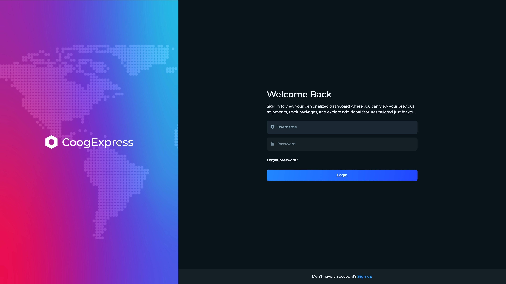
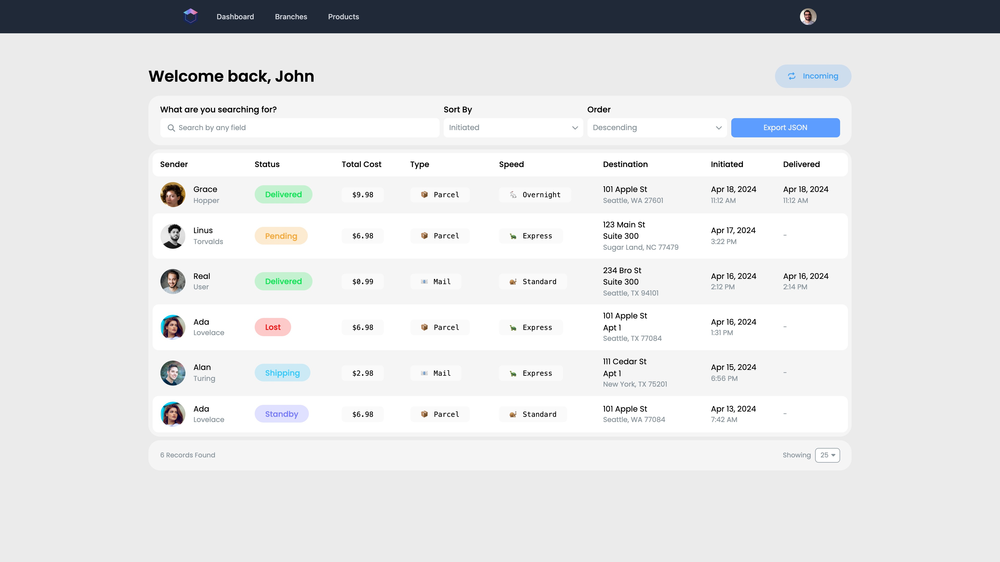
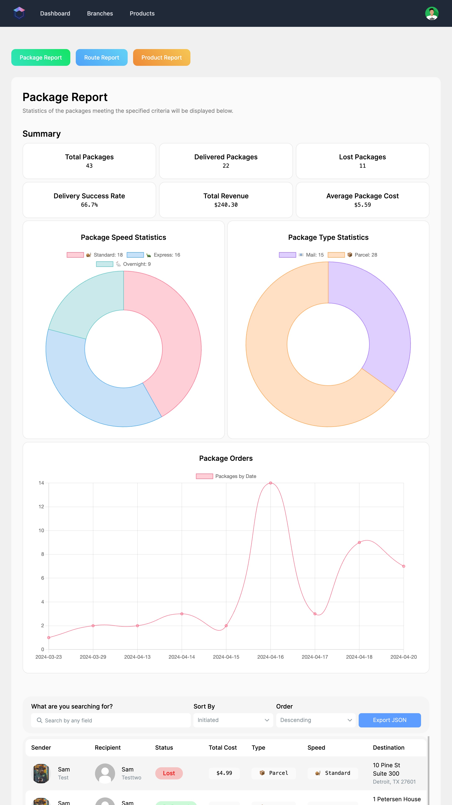
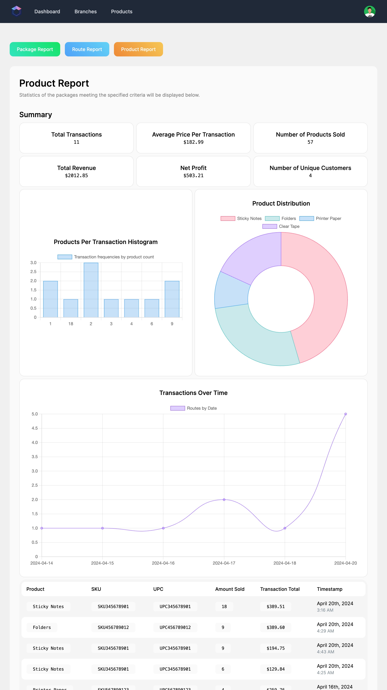
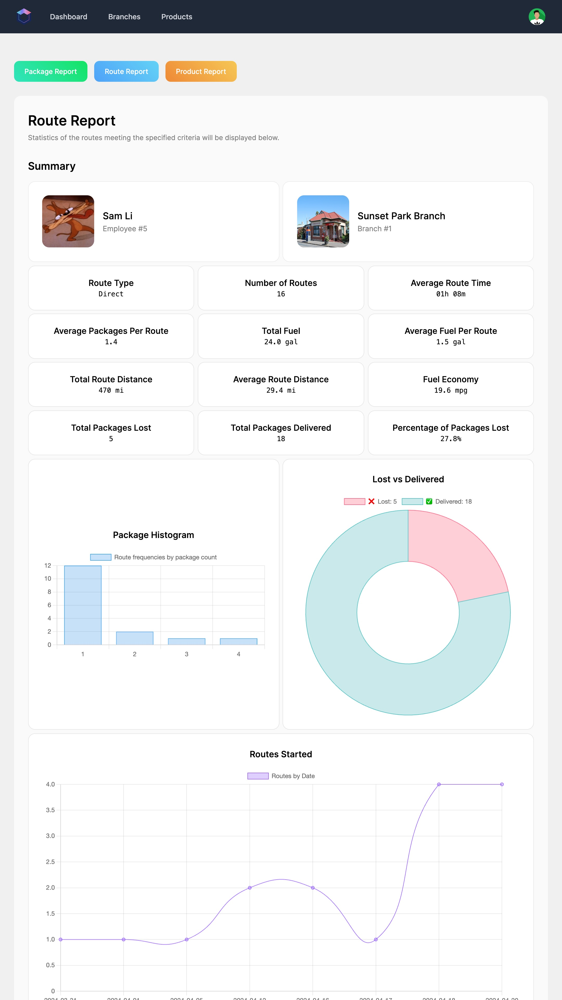
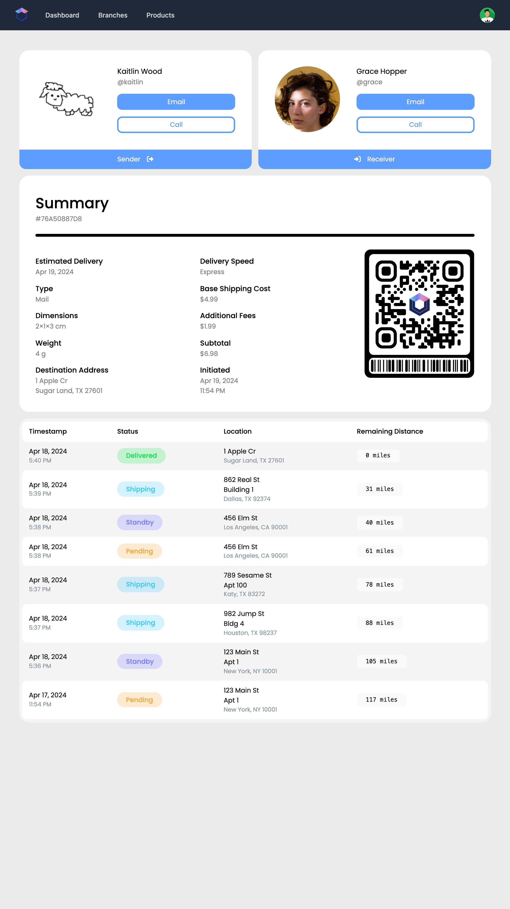
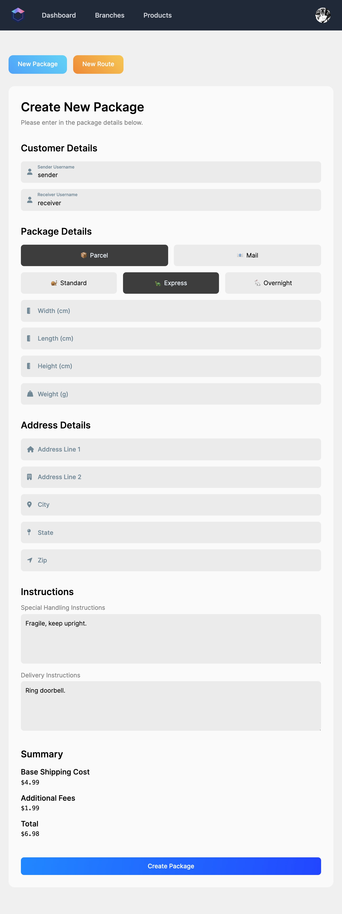
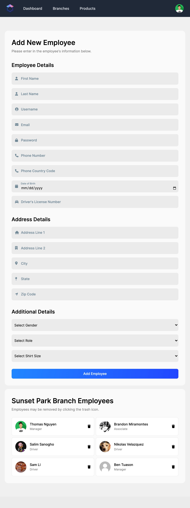

<div align="center">
  
  <hr>
  <p>
    This project was created for our Database Systems course (COSC 3380) at the University of Houston. Our task was to create a database system and a full stack website for a fictional post office.
  </p>
</div>

# About

**Short miniworld description**: CoogExpress is a fictional delivery company that delivers packages to all locations in the continental United States. The company has multiple branches, each with its own set of employees. Customers can place orders to send packages between branches. The website is where customers can track their packages or purchase items; retail associates can place orders; drivers can accept shipment routes; and managers can restock inventory, manage employees, and view reports at their respective branches.

# Screenshots

|                             |                              |
| :------------------------------------------------------------------------------------------------: | :--------------------------------------------------------------------------------------------------------------------------: |
|            |                                      |
|                |                                  |
|  |  |

# Project Requirements

### 5 Must Haves

- **User authentication for different user roles**.
  - Customers: request orders to be placed, view package history, track packages, buy products, and update their profile.
  - Associates: place orders, create routes, and update their profile.
  - Drivers: accept routes, deliver packages, and update their profile.
  - Managers: restock inventory, manage employees, view reports, and update their profile.
- **Data entry forms**:
  - Add new data:
    - Customers can self-register.
    - Customers can add credit cards.
    - Associates can add new package orders.
    - Associates can create routes.
    - Drivers can add new tracking history entries.
    - Managers can add employees.
  - Modify existing data:
    - Customers can update their profile.
    - Customers can add products to their shopping cart.
    - Drivers can accept routes.
    - Managers can restock their branch's inventory.
  - Delete data:
    - Customers can delete their account.
    - Customers can delete their credit cards.
    - Managers can delete employees.
- **Triggers**:
  1. Email notifications to the recipient when a package is delivered or lost.
  2. Email notifications to the manager when inventory stock falls below a certain threshold.
- **Data queries**:
  1. Get incoming/outgoing packages.
  2. Get package tracking history.
  3. Get a list of all branches.
  4. Get inventory of products at a specific branch.
  5. Get a customer/employee's profile information.
  6. Get pending packages at a specific branch.
  7. Get a list of routes that haven't been accepted.
  8. Get a list of all employees at a specific branch.
- **Data reports**: all reports have a date range filter and are meant for managers to generate only.
  1. Package report:
     - Choose from:
       - Internally sourced packages (packges originating from the current branch).
       - Externally sourced packages (packages originating from other branches passing through the current branch).
     - Displays the following statistics:
       - Total packages.
       - Delivered packages.
       - Lost packages.
       - Delivery success rate.
       - Total revenue.
       - Average package cost.
       - Donut chart of package speeds.
       - Donut chart of package types.
       - Line graph of packages orders over time.
     - Displays list of packages that generated the above statistics.
       - Searching, sorting, and exporting to JSON is supported.
  2. Route report:
     - Choose from:
       - The driver who completed the routes.
       - The destination branch of the routes.
       - The sorting criteria for the routes.
       - The ordering criteria for the routes.
     - Displays the following statistics:
       - Route type.
       - Number of routes.
       - Average route time.
       - Average packages per route.
       - Total fuel.
       - Average fuel per route.
       - Total route distance.
       - Average route distance.
       - Fuel economy.
       - Total packages lost.
       - Total packages delivered.
       - Percentage of packages lost.
       - Histogram of route frequencies by package count.
       - Donut chart of lost vs delivered packages.
       - Line graph of routes started over time.
     - Displays a list of routes that generated the above statistics.
  3. Products report:
     - Choose from:
       - Package category.
       - Sorting criteria.
       - Order criteria.
     - Displays the following statistics:
       - Total transactions.
       - Average price per transaction.
       - Number of products sold.
       - Total revenue.
       - Net profit.
       - Number of unique customers.
       - Histogram of transaction frequencies by product count.
       - Donut chart of product categories.
       - Line graph of transactions over time.
     - Displays a list of products that generated the above statistics.

# Technologies

### Frontend

 

### Backend

 

### Database

 

### Deployment


### Operating System


### Authentication


### Testing


### Third-Party APIs


# Hosting Locally

- Install [Git](https://git-scm.com) on your machine if you haven't already.
- Make sure [Node.js](https://nodejs.org/en/) version `20.11+` is installed on your machine. Some features may not work on older versions of Node.js.

### Cloning The Repository

```bash
git clone https://github.com/tthn0/CoogExpress
cd CoogExpress
```

> [!IMPORTANT]
> Ensure the `example.env` files in `Source/client`, `Source/server`, and `Source/database` are renamed to `.env` and are properly configured before hosting.

### Starting The Database

```bash
cd Source/database
docker-compose up -d
```

> [!IMPORTANT]
> After the database is up and running, you can import the dump file located inside `Source/database/backup` into the database using your preferred MySQL client.

### Starting The Client

```bash
cd Source/client
npm i -y
npm start
```

> [!NOTE]
> A new window will automatically open in your default browser on `http://localhost:3000`. All features of the website should be functional except for updating the profile picture. To remediate this, see more in the `Notes` section at the very end of this document.

### Starting The Server

```bash
cd Source/server
npm i -y
npm start
```

# Hosting On A Linux Server

- Install [Git](https://git-scm.com) and [Docker](https://www.docker.com) if you haven't already.
- Make sure [Node.js](https://nodejs.org/en/) version `20.11+` is installed. Some features may not work on older versions of Node.js.

### Cloning The Repository

```bash
git clone https://github.com/tthn0/CoogExpress
cd CoogExpress
```

> [!IMPORTANT]
> Ensure the `example.env` files in `Source/client`, `Source/server`, and `Source/database` are renamed to `.env` and are properly configured before hosting.

### Install Global Dependencies

```bash
sudo npm i -g serve
sudo npm i -g pm2
```

### Starting The Database

```bash
cd Source/database
docker-compose up -d
```

> [!IMPORTANT]
> After the database is up and running, you can import the dump file located inside `Source/database/backup` into the database using your preferred MySQL client.

### Starting The Client

```bash
cd Source/client
npm i -y
npm run build
pm2 start "serve -s build -l 3000"
```

### Starting The Server

```bash
cd Source/server
npm i -y
pm2 start "npm start"
```

# Notes

Some low priority items that don't really need to be fixed but are just noted here for documentation. They are in no particular order.

- Whenever a dump file generated from the Sequel Ace app (on macOS) is being imported, it will fail because:
  - The order of the views aren't properly exported.
    - To fix this, move the create statements for `package_view`, `branch_view`, `route_view`, and `receipt_view` down to the bottom, such that the last 4 views created are in that order.
  - The definer `wizard` doesn't exist.
    - To fix this, remove all `` `DEFINER=`wizard`@`%` `` statements from the dump file.
- If the database is hosted on Azure Database for MySQL Flexible Server, make sure to [disable the SSL flag](https://learn.microsoft.com/en-us/azure/mysql/flexible-server/how-to-connect-tls-ssl) in server parameters.
- The styling is inconsistent between browsers, specifically with select dropdowns.
- The `Products Per Transaction Histogram` horizontal axis isn't ordered properly.
  - This is possibly because it sorted as a string instead of a number, but it may not be the case since it hasn't been investigated yet.
  - To reproduce, go to the `Product Report` page on the manager's dashboard and select the following parameters:
    - Time period: `2024-03-01 ~ 2024-05-01`.
    - Product category: `Office Supplies`.
    - Click generate report using the `With Charts` button.
- Employees aren't able to buy products since they're not able to add billing information to their profile.
- Some timestamps are off by a few hours.
  - This hasn't been investigated yet but it could possibly be due to the timezone of the server.
- The `NavBar` can be a bit more DRY.
  - The `NavBar` component is repeated in all of the components that require it.
  - It's better to just have one `NavBar` component that's rendered inside of a `ProtectedRoute`.
- Managers are able to delete themselves but it probably shouldn't be allowed.
- There is a visual bug on the login/registration screen.
  - Sometimes, the moving global map will not be centered on the screen.
  - This usually doesn't happen in Chrome but happens in Safari quite a lot.
  - Refreshing the page might fix the issue when locally hosted.
  - However, on the hosted version, refreshing the page will not fix the issue on Safari, at least from our experience.
- On the hosted version of the site, the `crypto` API may not be working.
  - The `crypto` API is used on the client side `Package.jsx` to compute the hash of the package ID.
  - It's used to generate a tracking ID string for the package, although this hash is completely meaningless and is used for aesthetic purposes.
- When a driver exits an ongoing route, there is no way to re-enter the route page.
  - This is because the driver dashboard will only display routes that have not been accepted.
  - To re-enter the route page, the driver must return to the URL of the route they exited from.
- When a user deletes their account and attempts to make a new account using any of the same information that's required to be unique to a customer, the new account will not be created.
  - This is because the old account's data is still in the database. It's not actually deleted, just marked as deleted.
- User profile fields are locally stored in cookies. If one user has two active sessions on two different browsers, unexpected behavior may happen.
  - If a user updates their profile on one browser, their old profile state will remain in the other browser.
  - Field updates are only fetched at login.
  - So if a user wants to update their profile in one browser and switch to another browser, they must log out and log back in in that other browser.
- There are potential SQL injection vulnerabilities in `.Source/server/src/controllers/helper/process_cart.js`.
- There are potential race conditions in `./Source/server/src/controllers/entity/shopping_cart.js`.
  - This is because conditional logic is being performed on the server side instead of the database side.
  - This can be fixed by using transactions in the database.
- Updating profile pictures won't work when hosted on `localhost`.
  - This is because the client depends on the Imgur API which requires a domain to be whitelisted. Since the website is on `localhost`, the Imgur API will reject all requests. Therefore, the profile picture feature will not work locally.
  - This functionality will work when the website is deployed though.
  - A workaround is for testing profile picture functionality is to manually visit `http://0.0.0.0:3000` in the browser instead.
    - However, a new issue arises. Attemping to sign in to the locally hosted site on `http://0.0.0.0`, doesn't work in Chrome. The browser will block the request because it's considered a `CORS` violation.
    - To fix this, see [this StackOverflow post](https://stackoverflow.com/questions/66534759/cors-error-on-request-to-localhost-dev-server-from-remote-site).
    - In short, setting `chrome://flags/#block-insecure-private-network-requests` to `Disabled` will allow the request to go through.
- Passwords aren't actually hashed for development convenience.
- Email notifications for package deliveries reference `localhost:3000`.
  - This should be replaced with the domain name and port number of the actual website when it's hosted.
  - To change this, update the trigger in the `tracking_history` table.
- Some parts of the database are unused.
  - The `employee_schedule` table is unused.
  - The `preferred_branch_id` and `preferred_communication_method` columns in the `customer` table are unused.
- Employees shouldn't be able to buy products on their accounts. If they would like to purchase something, they should do so using a customer account.
- In the manager's dashboard, the date picker on the reports panel will make the `endDate`'s time exactly `00:00:00`. This may cause some confusion since it doesn't include the entire day (up to `23:59:59`).
- Billing information doesn't have a uniqueness constraint.
  - Multiple customers can have the same billing information.
  - A side effect of this is that a customer can have multiple billing entries that are identical (except for the billing information's ID).
  - To remediate this:
    - A uniqueness constraint should be added to the billing information table.
    - If a customer tries to add a billing information entry that already exists, the existing entry should be used instead.
- Whenever a manager deletes an employee, the employee isn't automatically signed out.
  - The employee's session still remains active until either their JWT expires or they log out.
- Package status can be one of the following:
  - `Standby`: The order has been placed, and a shipping label has been created, but it hasn't been loaded onto a truck yet.
    - A package may be in this state multiple times.
    - For example, if a package is transferred between branches, it would be marked as `Standby` again upon arriving at each branch.
  - `Pending`: The package has been loaded onto a truck but has not been accepted by a driver.
    - A package may be in this state multiple times.
    - For example, if the package is loaded onto a new truck, it would be marked as `Pending` again for each new truck.
  - `Shipping`: The package has been accepted by a driver and is on the move.
    - A package may be in this state multiple times.
    - The package may be dropped off at another branch and transferred onto another truck.
  - `Delivered`: The package has been delivered to the final destination.
    - A package may be in this state exactly once.
    - After a package is marked as `Delivered`, it cannot obtain a new status.
  - `Lost`: The package was lost during its transit.
    - A package may be in this state exactly once.
    - After a package is marked as `Lost`, it cannot obtain a new status.
